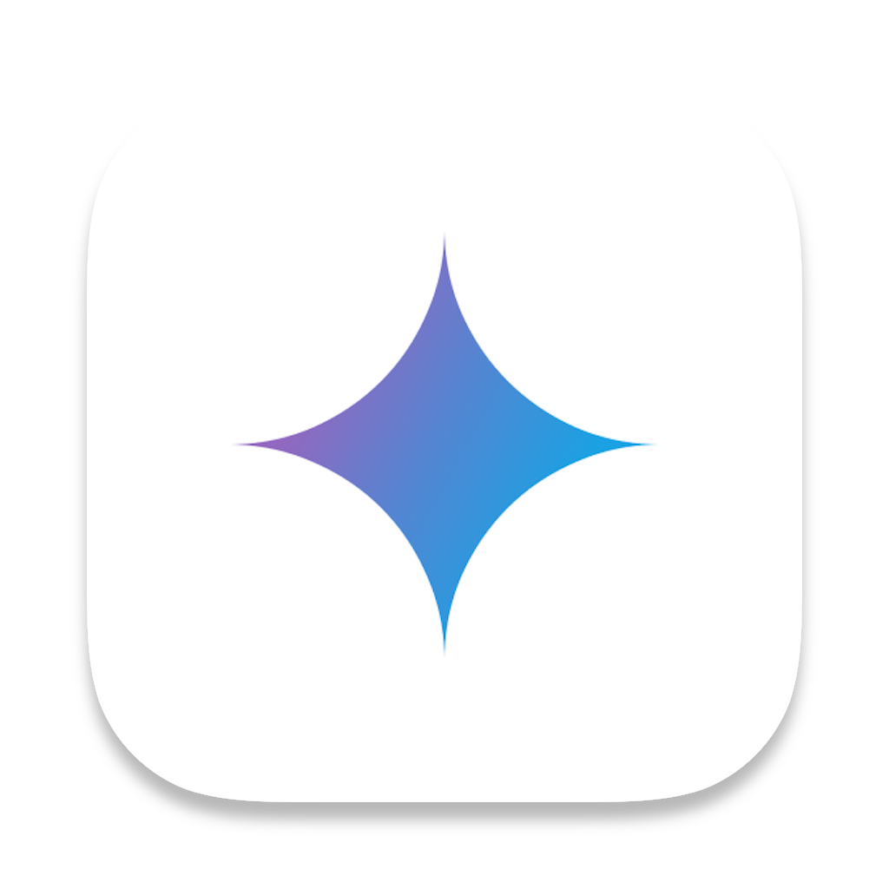
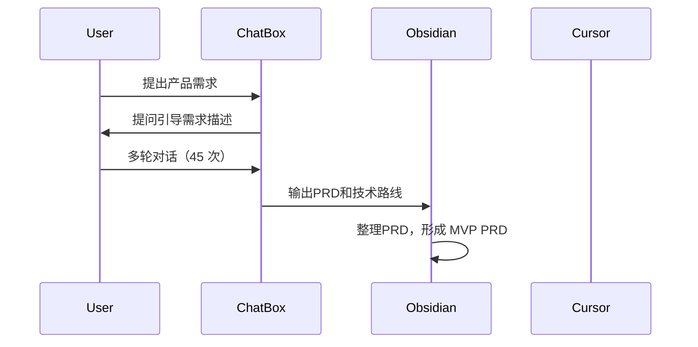
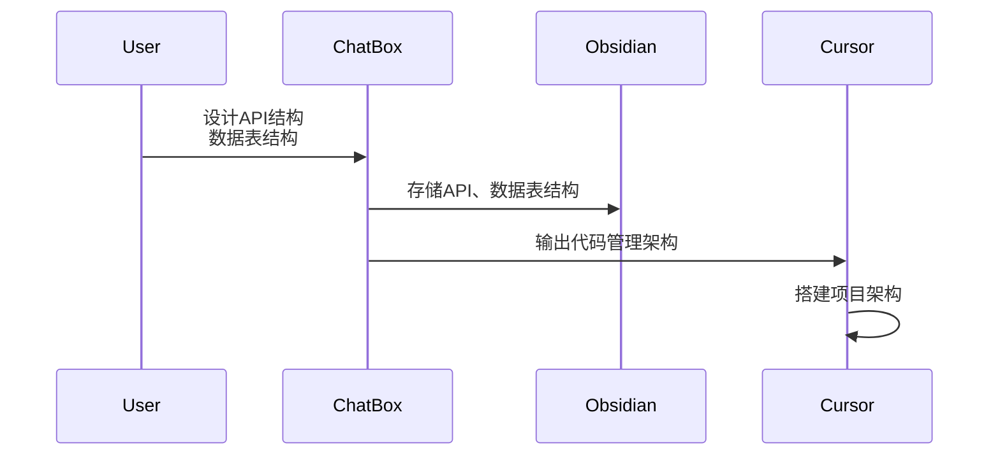
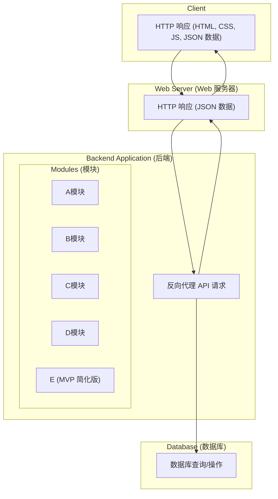
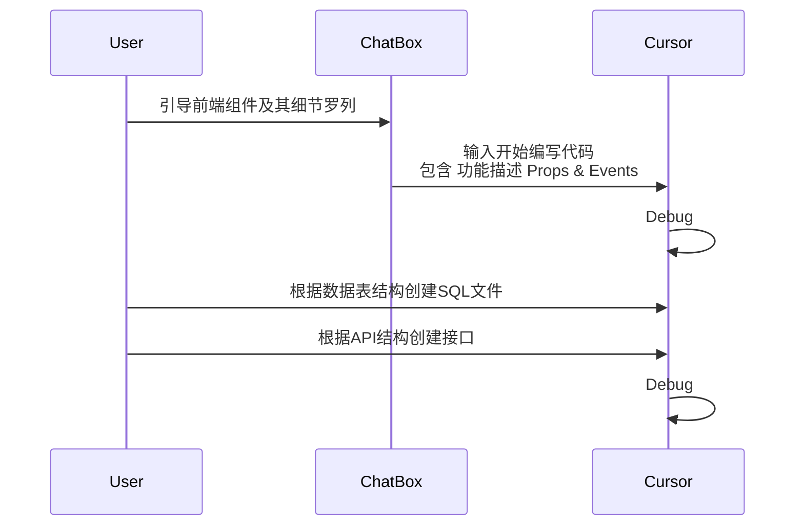

<GlowBackground>
  <div class="text-center px-8">
    <h1 class="text-5xl md:text-7xl font-bold tracking-tight text-white mb-8 leading-tight">
      在 vibe coding 之前，<br/> vibe 点什么好？
    </h1>
    <h2 class="text-3xl md:text-4xl font-medium tracking-wide text-gray-200 opacity-90 text-right">
      一个通用的工作流分享
    </h2>
    <div class="mt-12 text-center">
      <p class="text-xl md:text-2xl text-gray-300 mb-2">分享人：石先念</p>
      <p class="text-lg md:text-xl text-gray-400">深圳｜2025年6月8日</p>
    </div>
  </div>
</GlowBackground>

---

# 简要介绍

<div class="grid grid-cols-2 gap-8 h-full items-center">
  <div>
    <h2 class="text-3xl font-bold mb-6">分享人：石先念</h2>
    <ul class="text-lg space-y-2 mb-8">
      <li>深圳大学硕士研究生在读</li>
      <li>前富士康制程工程师</li>
      <li><strong>无编程经验</strong></li>
      <li><strong>无产品经验</strong></li>
    </ul>
    <h2 class="text-3xl font-bold mb-6">分享内容</h2>
    <ul class="text-lg space-y-2">
      <li>我的项目，AI 如何评价？</li>
      <li>如何从零 vibe 一个中大型项目</li>
      <li>分享几个 Cursor 的其他用法</li>
    </ul>
  </div>

  <div class="flex justify-center items-center">
    
  </div>
</div>


---

# 我的项目，AI 如何评价？
<br/>

### 项目规模：140 个源代码文件，22.1 KLOC
- **前端**：React 19 + Vite 6 + Ant Design 5
- **后端**：Go 1.24 + Gin + GORM + PostgreSQL
- **API接口**：按功能模块分组的完整RESTful API设计

<br/>

<div class="grid grid-cols-2 gap-8">

<div>

### 最大亮点
- 统一错误处理机制完善
- JSONB灵活存储设计巧妙
- 响应式设计支持多设备

</div>

<div>

### 最大问题
- 部分文件过大难维护
- 测试覆盖率不足
- 性能优化措施未实施

</div>

</div>


---

# 准备工作


<br/>

### 确定项目

- 市场调研
- 项目目标
- 确定技术栈

<br/>

### 工具

<br/>

<div class="grid grid-cols-2 gap-8">

<div>

<div class="flex items-center gap-4 mb-4">
  
  <h3 class="text-2xl font-bold">Gemini 2.0 flash thinking</h3>
</div>

- 推理能力强
- 幻觉低
- 费用低

</div>

<div>

<div class="flex items-center gap-4 mb-4">
  
  <h3 class="text-2xl font-bold">ChatBox</h3>
</div>

- 可以随时复制对话，形成分支
- 方便备份/恢复聊天记录

</div>

</div>


---


# Vibe PRD（需求分析）


---

# Vibe Structure（架构设计）



---

# Vibe Structure（架构设计）



---

<div class="grid grid-cols-2 gap-8 h-full text-sm">

<div class="text-left">

### 前端文件结构

```
src/
├── components/ # 共享组件
│ ├── Common/ # 通用组件
│ │ ├── Alert/ # 提示组件
│ │ ├── BreadcrumbNavigation/ # 面包屑导航组件
│ │ ...
│ │ └── ViewSwitcher/ # 视图切换组件
│ ├── Layout/ # 布局组件
│ ├── Sidebar/ # 侧边栏导航组件
│ ├── Amodule/ # A相关组件
│ │ ├── A/ # 操作按钮组件
│ │ ...
│ │ └── SearchInput/ # 搜索输入组件
│ └── B/ # B相关组件
│ ...
│ └── ViewSwitcher/ # 视图切换组件
├── pages/ # 页面组件
│ ├── AListPage/ # A列表页
│ │ ├── index.jsx # 页面组件实现
│ │ └── style.css # 页面样式
│ └── Users/ # 用户管理页
│ └── index.jsx # 页面组件实现
├── routes/ # 路由配置
│ └── index.jsx # 路由定义文件
└── services/ # 服务层
└── api.js # API服务
```

</div>

<div class="text-left">

### 后端文件结构

```
├── cmd/ # 主应用入口
│ └── server/ # 服务器入口代码，包含main.go
├── configs/ # 配置文件
│ ├── .env.example # 环境变量示例
│ └── config.go # 配置加载和管理
├── data/ # 数据目录(被gitignore)
├── docs/ # 文档目录
│ ├── api/ # API文档
│ └── database/ # 数据库设计文档
├── internal/ # 内部代码（不对外暴露的包）
│ ├── controllers/ # 控制器层，处理HTTP请求
│ │ ...
│ │ └── user_controller.go
│ ├── database/ # 数据库配置和连接管理
│ ├── middleware/ # HTTP中间件
│ ├── models/ # 数据模型和业务逻辑
│ │ ...
│ │ └── user.go
│ ├── routes/ # 路由定义
│ └── utils/ # 工具函数和辅助方法
├── pgsql/ # PostgreSQL相关配置
│ ├── docker-compose.yml # 数据库Docker配置
│ ├── init.sql # 数据库初始化SQL
│ └── data/ # 数据库数据目录(被gitignore)
├── .env # 环境变量(被gitignore)
├── .gitignore # Git忽略文件
├── go.mod # Go模块定义
├── go.sum # Go模块校验和
├── Makefile # Make构建文件
└── README.md # 项目说明文档
```

</div>

</div>


---

# Vibe Coding（代码实现）




---

# Cursor 一些其他用法

<div class="space-y-6">

<div class="py-8">

<!-- 第一排：三个图标 -->
<div class="grid grid-cols-3 gap-8 mb-16">
  <div class="flex flex-col items-center text-center py-4">
    <svg class="w-16 h-16 text-blue-500 mb-3" fill="none" stroke="currentColor" viewBox="0 0 24 24">
      <path stroke-linecap="round" stroke-linejoin="round" stroke-width="2" d="M9 19c-5 1.5-5-2.5-7-3m14 6v-3.87a3.37 3.37 0 0 0-.94-2.61c3.14-.35 6.44-1.54 6.44-7A5.44 5.44 0 0 0 20 4.77 5.07 5.07 0 0 0 19.91 1S18.73.65 16 2.48a13.38 13.38 0 0 0-7 0C6.27.65 5.09 1 5.09 1A5.07 5.07 0 0 0 5 4.77a5.44 5.44 0 0 0-1.5 3.78c0 5.42 3.3 6.61 6.44 7A3.37 3.37 0 0 0 9 18.13V22"/>
    </svg>
    <span class="text-lg font-medium">开源项目代码学习</span>
  </div>

  <div class="flex flex-col items-center text-center py-4">
    <svg class="w-16 h-16 text-green-500 mb-3" fill="none" stroke="currentColor" viewBox="0 0 24 24">
      <path stroke-linecap="round" stroke-linejoin="round" stroke-width="2" d="M10 20l4-16m4 4l4 4-4 4M6 16l-4-4 4-4"/>
    </svg>
    <span class="text-lg font-medium">二次开发</span>
  </div>

  <div class="flex flex-col items-center text-center py-4">
    <svg class="w-16 h-16 text-purple-500 mb-3" fill="none" stroke="currentColor" viewBox="0 0 24 24">
      <path stroke-linecap="round" stroke-linejoin="round" stroke-width="2" d="M15.232 5.232l3.536 3.536m-2.036-5.036a2.5 2.5 0 113.536 3.536L6.5 21.036H3v-3.572L16.732 3.732z"/>
    </svg>
    <span class="text-lg font-medium">二维绘图（.dxf、.cif）</span>
  </div>
</div>

<!-- 第二排：两个图标，居中对齐 -->
<div class="flex justify-center gap-50">
  <div class="flex flex-col items-center text-center py-4">
    <svg class="w-16 h-16 text-orange-500 mb-3" fill="none" stroke="currentColor" viewBox="0 0 24 24">
      <path stroke-linecap="round" stroke-linejoin="round" stroke-width="2" d="M8 9l3 3-3 3m5 0h3M5 20h14a2 2 0 002-2V6a2 2 0 00-2-2H5a2 2 0 00-2 2v12a2 2 0 002 2z"/>
    </svg>
    <span class="text-lg font-medium">MCP控制其他工具</span>
  </div>

  <div class="flex flex-col items-center text-center py-4">
    <svg class="w-16 h-16 text-red-500 mb-3" fill="none" stroke="currentColor" viewBox="0 0 24 24">
      <path stroke-linecap="round" stroke-linejoin="round" stroke-width="2" d="M9 12h6m-6 4h6m2 5H7a2 2 0 01-2-2V5a2 2 0 012-2h5.586a1 1 0 01.707.293l5.414 5.414a1 1 0 01.293.707V19a2 2 0 01-2 2z"/>
    </svg>
    <span class="text-lg font-medium">LaTeX 撰写</span>
  </div>
</div>

</div>

</div>


---
layout: cover
class: text-center
---

<GlowBackground>
<div class="text-center px-8 h-full flex flex-col justify-between">

<div class="flex-1 flex justify-center items-center">
<div class="flex justify-center items-center gap-16">
<div class="text-center">

<p class="text-xl text-gray-300">个人微信</p>
</div>
<div class="text-center">

<p class="text-xl text-gray-300">公众号</p>
</div>
</div>
</div>

<div class="pb-8">

# Thank you for attending!

</div>

</div>
</GlowBackground>
